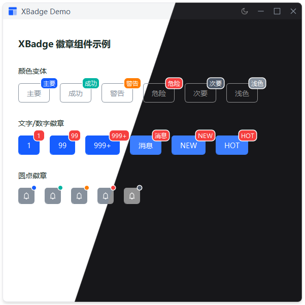

# XBadge

徽章组件，提供图标徽章和文本徽章两种类型，自动跟随目标组件定位。

## 示例


## 导入

```python
from xsideui import XIconBadge, XTextBadge, XColor
```

### 方法

| 方法 | 说明              | 返回值 |
|------|-----------------|--------|
| `remove_tag_from(target: QWidget, tag: str)` | 移除指定目标组件指定标签的徽章 | None |
| `remove_all_from(target: QWidget)` | 移除指定目标组件全部徽章    | None |

## XIconBadge 图标徽章

用于显示状态指示器，如在线/离线、新消息提醒。

### 参数

| 参数          | 类型           | 默认值              | 说明             |
|-------------|--------------|------------------|----------------|
| `target`    | QWidget      | -                | 目标组件           |
| `icon_name` | IconName/str | -                | 图标名            |
| `color`     | XColor/str   | XColor.DANGER    | 图标颜色           |
| `size`      | int          | 18               | 尺寸（像素）         |
| `offset`    | QPoint       | QPoint(0, 0)     | 偏移量            |
| `anchor`    | Anchor       | Anchor.TOP_RIGHT | 锚点,类内部枚举       |
| `tag`    | str          | default          | 标签（同目标组件多徽章使用） |

### 示例

```python
XIconBadge(btn, IconName.STAR_FILL, color=XColor.WARNING, size=14, offset=QPoint(-10, 10))
```

---

## XTextBadge 文本徽章

用于显示数量或文字，如购物车数量、未读消息。

### 参数

| 参数 | 类型 | 默认值 | 说明 |
|------|------|--------|------|
| `target` | QWidget | - | 目标组件 |
| `text` | str | "0" | 显示文字 |
| `color` | XColor/str | XColor.SUCCESS | 颜色 |
| `offset` | QPoint | QPoint(0, 0) | 偏移量 |
| `anchor`    | Anchor       | Anchor.TOP_RIGHT | 锚点,类内部枚举       |
| `tag`    | str          | default          | 标签（同目标组件多徽章使用） |

### 方法

| 方法 | 说明 | 返回值 |
|------|------|--------|
| `set_content(text)` | 更新徽章文字内容 | None |

### 示例

```python
# 基础用法
text = XTextBadge(button, "5")

# 指定颜色
text = XTextBadge(button, "99+", color=XColor.DANGER)

# 更新内容
text.set_content("100+")
```

---

## 使用说明

⚠️ **重要**：徽章必须在目标组件布局完成后再创建，否则定位可能不准确。

### 延迟创建（推荐）

```python
from PySide2.QtCore import QTimer

# 先创建按钮
button = XPushButton("消息")
layout.addWidget(button)

# 延迟创建徽章
QTimer.singleShot(0, lambda: XDotBadge(button))
```

---

## 特性

- ✅ 图标徽章和文本徽章两种类型
- ✅ 自动跟随目标组件定位
- ✅ 支持 XColor 枚举和自定义颜色
- ✅ 鼠标穿透，不阻挡目标组件交互
- ✅ 文本徽章自动调整尺寸
