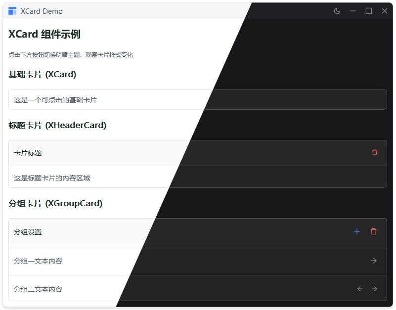

# XCard

卡片组件，包含三种类型：基础卡片、标题卡片、分组卡片。

## 示例



## 导入

```python
from xsideui import XCard, XHeaderCard, XGroupCard
```

## XCard 基础卡片

简单的容器卡片，支持添加组件和布局，可选择是否可点击。

### 参数

| 参数 | 类型 | 默认值 | 说明 |
|------|------|--------|------|
| `padding` | tuple | (11,11,11,11) | 内边距 |
| `spacing` | int | 8 | 组件间距 |
| `clickable` | bool | False | 是否可点击 |
| `parent` | QWidget | None | 父组件 |

### 方法

| 方法 | 说明 | 返回值 |
|------|------|--------|
| `addWidget(widget, stretch=0, alignment=Qt.Alignment())` | 添加组件 | None |
| `addLayout(layout, stretch=0)` | 添加布局 | None |
| `set_clickable(clickable)` | 设置是否可点击 | XCard |
| `clear()` | 清空卡片内容 | None |

### 信号

| 信号 | 说明 |
|------|------|
| `clicked` | 点击时触发（需设置 `clickable=True`） |

### 示例

```python
# 基础用法
card = XCard()
card.addWidget(XLabel("内容"))

# 可点击卡片
card = XCard(clickable=True)
card.clicked.connect(lambda: print("点击"))
```

---

## XHeaderCard 标题卡片

带标题栏的卡片，分为 HEADER 和 CONTENT 两个区域，支持链式调用。

### 参数

| 参数 | 类型 | 默认值 | 说明 |
|------|------|--------|------|
| `title` | str | "" | 标题文本 |
| `header_padding` | tuple | (11,11,11,11) | 标题栏内边距 |
| `content_padding` | tuple | (11,11,11,11) | 内容区内边距 |
| `spacing` | int | 8 | 内容区组件间距 |
| `parent` | QWidget | None | 父组件 |

### 方法

| 方法 | 说明 | 返回值 |
|------|------|--------|
| `addWidget(widget, target=CardPosition.CONTENT, stretch=0, alignment=Qt.Alignment())` | 添加组件 | XHeaderCard |
| `addLayout(layout, target=CardPosition.CONTENT, stretch=0)` | 添加布局 | XHeaderCard |
| `set_title(title)` | 设置标题 | None |
| `clear()` | 清空内容区域（保留标题栏） | None |
| `add_stretch()` | 底部添加弹性空间 | None |

### CardPosition 枚举

| 值 | 说明 |
|------|------|
| `CardPosition.HEADER` | 标题栏区域 |
| `CardPosition.CONTENT` | 内容区域 |

### 示例

```python
# 基础用法
card = XHeaderCard(title="标题")
card.addWidget(XLabel("内容"))

# 链式调用
card = XHeaderCard(title="标题") \
    .addWidget(btn, target=CardPosition.HEADER) \
    .addWidget(XLabel("内容"), target=CardPosition.CONTENT)
```

---

## XGroupCard 分组卡片

支持多个分组的卡片，每个分组间自动添加分隔线，通过 GroupProxy 支持链式调用。

### 参数

| 参数 | 类型 | 默认值 | 说明 |
|------|------|--------|------|
| `title` | str | "" | 标题文本 |
| `header_padding` | tuple | (11,11,11,11) | 标题栏内边距 |
| `group_padding` | tuple | (11,11,11,11) | 分组内边距 |
| `spacing` | int | 8 | 分组内组件间距 |
| `parent` | QWidget | None | 父组件 |

### 方法

| 方法 | 说明 | 返回值 |
|------|------|--------|
| `add_group()` | 添加新分组 | GroupProxy |
| `addWidget(widget, target=CardPosition.GROUP, group_index=0, stretch=0, alignment=Qt.Alignment())` | 添加组件 | None |
| `addLayout(layout, target=CardPosition.GROUP, group_index=0, stretch=0)` | 添加布局 | None |
| `set_title(title)` | 设置标题 | None |
| `clear()` | 清空所有分组（保留标题栏） | None |
| `addStretch()` | 底部添加弹性空间 | None |

### GroupProxy 分组代理

`add_group()` 返回的代理对象，支持链式调用添加组件到分组。

| 方法 | 说明 | 返回值 |
|------|------|--------|
| `add(widget, stretch=0, alignment=Qt.Alignment())` | 添加组件 | GroupProxy |
| `addLayout(layout, stretch=0)` | 添加布局 | GroupProxy |

### 示例

```python
# 基础用法
card = XGroupCard(title="设置")

# 链式调用添加分组
card.add_group() \
    .add(XLabel("分组1")) \
    .add(XPushButton("按钮"))

# 添加多个分组
card.add_group().add(XLabel("分组2"))

# 添加到标题栏
card.addWidget(XPushButton("清空"), target=CardPosition.HEADER)
```

---

## 特性

- ✅ 三种卡片类型：基础卡片、标题卡片、分组卡片
- ✅ 支持链式调用
- ✅ 自动适配主题切换
- ✅ 支持点击事件
- ✅ 分组卡片自动添加分隔线
