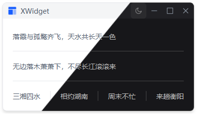

# XDivider

分割线组件，支持横向和竖向，深度适配 XColor 枚举。

## 示例



## 导入

```python
from xsideui import XDivider
```

## 参数

| 参数 | 类型 | 默认值 | 说明 |
|------|------|--------|------|
| `vertical` | bool | False | 是否竖向分割线 |
| `size` | int | 1 | 分割线粗细（像素） |
| `color` | XColor 或 str | '' | 分割线颜色 |
| `parent` | QWidget | None | 父组件 |

## 方法

| 方法 | 说明 | 返回值 |
|------|------|--------|
| `set_color_type(color)` | 动态改变颜色类型 | None |

## 示例

```python
# 基础用法（横向分割线）
divider = XDivider()

# 竖向分割线
divider = XDivider(vertical=True)

# 自定义粗细
divider = XDivider(size=2)

# 使用 XColor 枚举
from xsideui import XColor
divider = XDivider(color=XColor.PRIMARY)

# 使用自定义颜色
divider = XDivider(color="#FF0000")

# 组合参数
divider = XDivider(vertical=True, size=2, color=XColor.SUCCESS)

# 动态修改颜色
divider.set_color_type(XColor.DANGER)
divider.set_color_type("#00FF00")
```

## 特性

- ✅ 支持横向和竖向分割线
- ✅ 支持 XColor 枚举颜色
- ✅ 支持自定义颜色值（如 #FF0000）
- ✅ 可自定义粗细
- ✅ 动态颜色切换
- ✅ 自动适配主题切换
