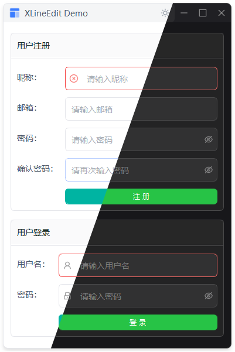

# XLineEdit 输入框组件

继承自 `QLineEdit`，提供图标、状态和尺寸定制功能。

## 功能特性

- 预设尺寸：LARGE / DEFAULT / SMALL / MINI
- 前缀/后缀图标（支持主题切换）
- 清空按钮
- 密码显示切换
- 状态样式：error / success
- 链式调用
- 图标点击事件
- 国际化支持

## 示例



## 快速开始

```python
from src.xsideui.widgets import XLineEdit
from src.xsideui.icon import IconName
from src.xsideui.xenum import XColor

# 基本使用
input = XLineEdit(placeholder="请输入内容")

# 带图标
input = XLineEdit(
    placeholder="搜索",
    prefix_icon=IconName.SEARCH
)

# 链式调用
input = XLineEdit().set_size("large").set_clearable(True).set_prefix_icon(IconName.SEARCH)
```

## 构造函数

```python
XLineEdit(
    placeholder: str = "",           # 占位文本
    size: Union[XSize, str] = XSize.DEFAULT,  # 尺寸
    clearable: bool = False,        # 显示清空按钮
    show_password: bool = False,    # 显示密码切换
    prefix_icon: Union[str, IconName] = None,  # 前缀图标名称或枚举
    suffix_icon: Union[str, IconName] = None,  # 后缀图标名称或枚举
    status: Union[XInputStatus, str] = None,  # 状态
    parent = None
)
```

## 预设尺寸

| 尺寸 | 字号 | 适用场景 |
|------|------|----------|
| LARGE | 16px | 重要输入 |
| DEFAULT | 14px | 常规输入 |
| SMALL | 12px | 紧凑布局 |
| MINI | 11px | 工具栏 |

## 方法

### set_size(size)

设置输入框尺寸

```python
input.set_size(XSize.LARGE)
input.set_size("large")
```

### set_prefix_icon(icon, size=16, color=XColor.SECONDARY)

设置前缀图标

```python
# 使用枚举
input.set_prefix_icon(IconName.SEARCH, size=16, color=XColor.SECONDARY)

# 使用字符串
input.set_prefix_icon("search", size=16, color=XColor.SECONDARY)

# 使用默认值（size=16, color=XColor.SECONDARY）
input.set_prefix_icon(IconName.SEARCH)
```

### set_suffix_icon(icon, size=16, color=XColor.SECONDARY)

设置后缀图标

```python
input.set_suffix_icon(IconName.EMAIL, size=16, color=XColor.SECONDARY)
```

### set_clearable(clearable)

设置是否显示清空按钮

```python
input.set_clearable(True)
```

### set_show_password(show)

设置是否显示密码切换

```python
input.set_show_password(True)
```

### set_status(status)

设置输入框状态

```python
from src.xsideui.widgets import XInputStatus
input.set_status(XInputStatus.ERROR)
input.set_status(XInputStatus.SUCCESS)
input.set_status(None)  # 清除状态
```

## 信号

### iconClicked

图标点击信号

```python
def on_icon_clicked(position):
    print(f"点击了 {position} 图标")  # position: "prefix" 或 "suffix"

input.iconClicked.connect(on_icon_clicked)
```

## 完整示例

```python
import sys
from PySide2.QtWidgets import QApplication, QWidget, QVBoxLayout
from src.xsideui.widgets import XLineEdit, XLabel, XDivider
from src.xsideui.icon import IconName
from src.xsideui.xenum import XSize, XInputStatus, XColor

app = QApplication(sys.argv)

widget = QWidget()
layout = QVBoxLayout()

layout.addWidget(XLabel("XLineEdit 示例", style=XLabel.Style.H1))
layout.addWidget(XDivider())

# 不同尺寸
layout.addWidget(XLabel("不同尺寸"))
layout.addWidget(XLineEdit(placeholder="Large", size=XSize.LARGE))
layout.addWidget(XLineEdit(placeholder="Default", size=XSize.DEFAULT))
layout.addWidget(XLineEdit(placeholder="Small", size=XSize.SMALL))
layout.addWidget(XLineEdit(placeholder="Mini", size=XSize.MINI))

# 带图标
layout.addWidget(XLabel("带图标"))
layout.addWidget(XLineEdit(placeholder="搜索", prefix_icon=IconName.SEARCH))
layout.addWidget(XLineEdit(placeholder="用户", prefix_icon=IconName.USER))
layout.addWidget(XLineEdit(placeholder="邮箱", suffix_icon=IconName.EMAIL, color=XColor.PRIMARY))

# 功能
layout.addWidget(XLabel("功能"))
layout.addWidget(XLineEdit(placeholder="可清空", clearable=True))
layout.addWidget(XLineEdit(placeholder="密码输入", show_password=True))

# 状态
layout.addWidget(XLabel("状态"))
layout.addWidget(XLineEdit(placeholder="错误状态", status=XInputStatus.ERROR))
layout.addWidget(XLineEdit(placeholder="成功状态", status=XInputStatus.SUCCESS))

widget.setLayout(layout)
widget.show()
sys.exit(app.exec_())
```

## 常见问题

**Q: 如何清空输入框？**

```python
input.clear()
```

**Q: 如何获取输入值？**

```python
value = input.text()
```

**Q: 如何监听回车键？**

```python
input.returnPressed.connect(lambda: print(input.text()))
```
