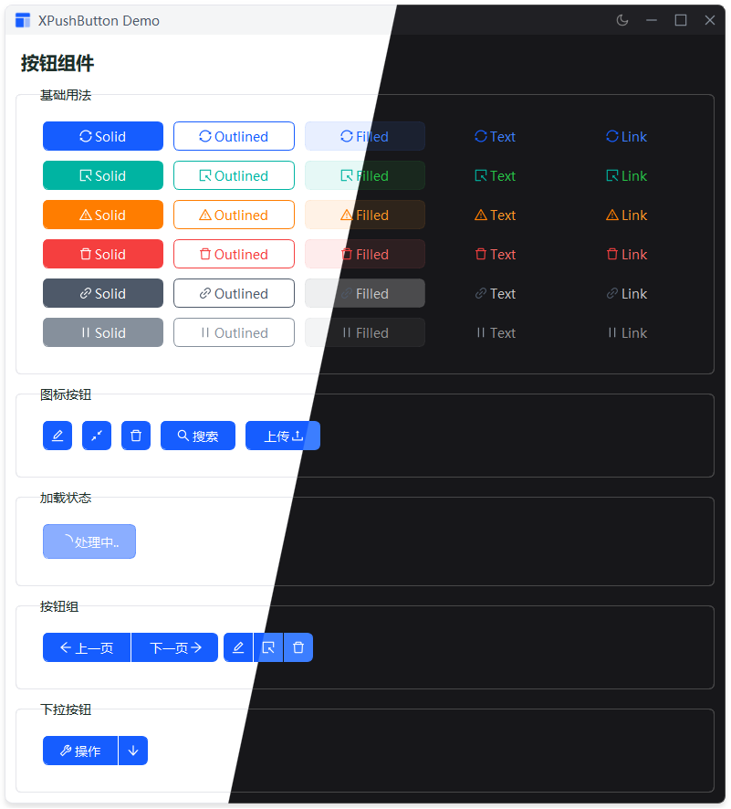

# XPushButton 按钮组件

高性能按钮组件，支持多种变体、颜色、尺寸和图标。

## 组件列表

- [XPushButton](#xpushbutton-按钮组件) - 基础按钮组件
- [XPushButtonGroup](#xpushbuttongroup-按钮组组件) - 按钮组组件
- [XPushButtonDropdown](#xpushbuttondropdown-下拉按钮组件) - 下拉按钮组件

---

## XPushButton 按钮组件

### 特性

- ✅ 5种按钮变体（solid/outlined/filled/text/link）
- ✅ 6种预设颜色（primary/success/warning/danger/secondary/tertiary）
- ✅ 4种尺寸（large/default/small/mini）
- ✅ 图标支持（自动适配主题色）
- ✅ Loading 状态
- ✅ 主题适配

## 示例



### 快速开始

```python
from src.xsideui.widgets import XPushButton
from src.xsideui.widgets import XButtonVariant, XColor, XSize

# 基础按钮
button = XPushButton("点击我")

# 带图标
button = XPushButton("提交", icon="check", color=XColor.PRIMARY)

# 链式调用
button = XPushButton("按钮").set_variant(XButtonVariant.OUTLINED).set_color(XColor.SUCCESS)
```

### 构造函数

```python
XPushButton(
    text: str = "",                      # 按钮文本
    icon: Union[str, IconName] = None,   # 图标名称
    variant: Union[XButtonVariant, str] = XButtonVariant.SOLID,  # 变体
    color: Union[XColor, str] = XColor.PRIMARY,  # 颜色
    size: Union[XSize, str] = XSize.DEFAULT,  # 尺寸
    disabled: bool = False,                # 是否禁用
    parent=None
)
```

### 按钮变体

| 变体 | 说明 |
|------|------|
| `solid` | 实心按钮（默认） |
| `outlined` | 描边按钮 |
| `filled` | 填充按钮 |
| `text` | 文本按钮 |
| `link` | 链接按钮 |

### 颜色类型

| 颜色 | 说明 |
|------|------|
| `primary` | 主要色（默认） |
| `success` | 成功色 |
| `warning` | 警告色 |
| `danger` | 危险色 |
| `secondary` | 次要色 |
| `tertiary` | 浅色 |

### 尺寸规格

| 尺寸 | 高度 | 适用场景 |
|------|------|---------|
| `large` | 40px | 强调按钮 |
| `default` | 32px | 常规使用（默认） |
| `small` | 28px | 紧凑布局 |
| `mini` | 24px | 极度紧凑 |

### 方法

| 方法 | 说明 |
|------|------|
| `set_variant(variant)` | 设置按钮变体 |
| `set_color(color)` | 设置按钮颜色 |
| `set_size(size)` | 设置按钮尺寸 |
| `set_x_icon(icon)` | 设置图标 |
| `set_icon_position(position)` | 设置图标位置（left/right） |
| `set_loading(loading)` | 设置加载状态 |
| `set_disabled(disabled)` | 设置禁用状态 |
| `variant()` | 获取当前按钮变体 |
| `color()` | 获取当前按钮颜色 |
| `size_type()` | 获取当前按钮尺寸 |
| `is_loading()` | 获取按钮是否处于加载状态 |

### 使用示例

```python
# 不同变体
XPushButton("实心", variant="solid", color="primary")
XPushButton("描边", variant="outlined", color="primary")
XPushButton("填充", variant="filled", color="primary")
XPushButton("文本", variant="text", color="primary")
XPushButton("链接", variant="link", color="primary")

# 带图标
XPushButton("提交", icon="check", color="primary")
XPushButton(icon="search", size="large")

# Loading 状态
button = XPushButton("保存", icon="save")
button.set_loading(True)

# 链式调用
button = XPushButton("按钮")
button.set_variant("outlined").set_color("success").set_x_icon("check")
```

---

## XPushButtonGroup 按钮组组件

### 特性

- ✅ 自动处理圆角拼接
- ✅ 支持边框重叠
- ✅ 水平/垂直排列
- ✅ 动态添加/移除按钮

### 快速开始

```python
from src.xsideui.widgets import XPushButton, XPushButtonGroup
from src.xsideui.widgets import XColor

# 创建按钮组
group = XPushButtonGroup()

# 添加按钮
group.add_button(XPushButton("按钮1", color=XColor.PRIMARY))
group.add_button(XPushButton("按钮2", color=XColor.PRIMARY))
group.add_button(XPushButton("按钮3", color=XColor.PRIMARY))
```

### 构造函数

```python
XPushButtonGroup(
    buttons: List[QWidget] = None,  # 按钮列表
    vertical: bool = False,          # 是否垂直排列，默认 False（水平排列）
    spacing: int = -1,              # 按钮间距，-1 表示边框重叠（默认）
    parent=None
)
```

### 方法

| 方法 | 说明 |
|------|------|
| `add_button(button)` | 添加单个按钮到组 |
| `add_buttons(buttons)` | 添加多个按钮到组 |
| `remove_button(button)` | 从组中移除按钮 |
| `clear()` | 清空所有按钮 |

### 使用示例

```python
# 水平按钮组（默认）
group = XPushButtonGroup()
group.add_button(XPushButton("左", color="primary"))
group.add_button(XPushButton("中", color="primary"))
group.add_button(XPushButton("右", color="primary"))

# 垂直按钮组
group = XPushButtonGroup(vertical=True)
group.add_button(XPushButton("上", color="primary"))
group.add_button(XPushButton("下", color="primary"))

# 边框重叠（默认）
group = XPushButtonGroup(spacing=-1)

# 自定义间距
group = XPushButtonGroup(spacing=10)

# 动态添加
group.add_buttons([
    XPushButton("按钮1", color="primary"),
    XPushButton("按钮2", color="primary"),
    XPushButton("按钮3", color="primary")
])

# 移除按钮
group.remove_button(button1)

# 清空所有
group.clear()
```

---

## XPushButtonDropdown 下拉按钮组件

### 特性

- ✅ 主按钮 + 下拉箭头
- ✅ 支持菜单功能
- ✅ 自动适配按钮样式
- ✅ 动态更新菜单项

### 快速开始

```python
from src.xsideui.widgets import XPushButtonDropdown
from src.xsideui.widgets import XColor

# 创建下拉按钮
dropdown = XPushButtonDropdown(
    text="操作",
    menu_items=[
        {"text": "选项1", "value": "option1"},
        {"text": "选项2", "value": "option2"},
        {"text": "选项3", "value": "option3"}
    ],
    color=XColor.PRIMARY
)

# 监听菜单点击
dropdown.menuTriggered.connect(lambda value: print(f"选择: {value}"))

# 监听主按钮点击
dropdown.clicked.connect(lambda: print("主按钮被点击"))
```

### 构造函数

```python
XPushButtonDropdown(
    text: str = "",                      # 主按钮显示的文本
    menu_items: List[Dict] = None,       # 菜单项列表
    variant: Union[str, XButtonVariant] = "solid",  # 按钮样式变体
    color: Union[str, XColor] = "primary",  # 按钮主题颜色
    size: Union[str, XSize] = "default",  # 按钮尺寸规格
    icon: Union[str, IconName] = None,    # 主按钮左侧的图标名称
    parent=None
)
```

### 信号

| 信号 | 说明 |
|------|------|
| `clicked` | 主按钮点击时触发 |
| `menuTriggered(str)` | 菜单项点击时触发，参数为菜单项的 value 值 |

### 方法

| 方法 | 说明 |
|------|------|
| `set_menu_items(items)` | 动态更新下拉菜单的内容 |
| `setEnabled(enabled)` | 设置启用/禁用状态 |
| `isEnabled()` | 获取当前组件的启用状态 |

### 使用示例

```python
# 基础用法
dropdown = XPushButtonDropdown(
    text="选择",
    menu_items=[
        {"text": "选项A", "value": "A"},
        {"text": "选项B", "value": "B"},
        {"text": "选项C", "value": "C"}
    ]
)

# 带图标
dropdown = XPushButtonDropdown(
    text="导出",
    icon="download",
    menu_items=[
        {"text": "导出 PDF", "value": "pdf"},
        {"text": "导出 Excel", "value": "excel"},
        {"text": "导出 CSV", "value": "csv"}
    ],
    color="success"
)

# 不同样式
dropdown = XPushButtonDropdown(
    text="操作",
    variant="outlined",
    color="primary",
    size="large",
    menu_items=[...]
)

# 动态更新菜单
dropdown.set_menu_items([
    {"text": "新选项1", "value": "new1"},
    {"text": "新选项2", "value": "new2"}
])

# 监听事件
dropdown.clicked.connect(lambda: print("主按钮点击"))
dropdown.menuTriggered.connect(lambda value: print(f"菜单选择: {value}"))

# 禁用/启用
dropdown.setEnabled(False)
dropdown.setEnabled(True)
```

### 菜单项格式

```python
menu_items = [
    {
        "text": "显示名称",  # 菜单项显示的文本
        "value": "触发值"       # 点击时传递的数据（可选）
    },
    # 简化格式：value 默认使用 text
    {
        "text": "选项1"
    }
]
```

---

## 常见问题

**Q: 如何设置图标？**

A: 使用 `icon` 参数或 `set_x_icon()` 方法。

```python
button = XPushButton("提交", icon="check")
button.set_x_icon("close")
```

**Q: 图标颜色如何适配？**

A: 实心按钮图标为白色，其他变体图标跟随主题色，自动适配。

**Q: 如何监听点击事件？**

A: 使用 `clicked` 信号。

```python
button.clicked.connect(lambda: print("点击"))
```

**Q: Loading 状态会禁用按钮吗？**

A: 会自动禁用，结束后恢复。

**Q: 如何获取当前状态？**

A: 使用 getter 方法。

```python
button.variant()   # 获取变体
button.color()     # 获取颜色
button.size_type() # 获取尺寸
button.is_loading() # 是否加载中
```

**Q: 按钮组如何实现边框重叠？**

A: 使用默认的 `spacing=-1` 参数。

```python
group = XPushButtonGroup(spacing=-1)  # 边框重叠
group = XPushButtonGroup(spacing=10)  # 自定义间距
```

**Q: 下拉按钮如何动态更新菜单？**

A: 使用 `set_menu_items()` 方法。

```python
dropdown.set_menu_items([
    {"text": "新选项", "value": "new"}
])
```
