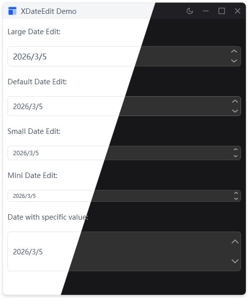

# XDateEdit

日期编辑框，继承自 QDateEdit。
## 示例



## 导入

```python
from xsideui import XDateEdit, XSize
```

## 用法

```python
# 创建
date_edit = XDateEdit()
        
# 设置尺寸
date_edit.set_size(XSize.LARGE)

# 获取/设置日期
date_edit.setDate(QDate.currentDate())
current_date = date_edit.date()
```

## 尺寸

| 枚举 | 字符串 |
|------|--------|
| `XSize.LARGE` | `"large"` |
| `XSize.DEFAULT` | `"default"` |
| `XSize.SMALL` | `"small"` |
| `XSize.MINI` | `"mini"` |

## 信号

继承自 QDateEdit：`dateChanged(QDate)`

## 样式

由 `qdateedit.qss` 控制，通过 padding 调整高度。
