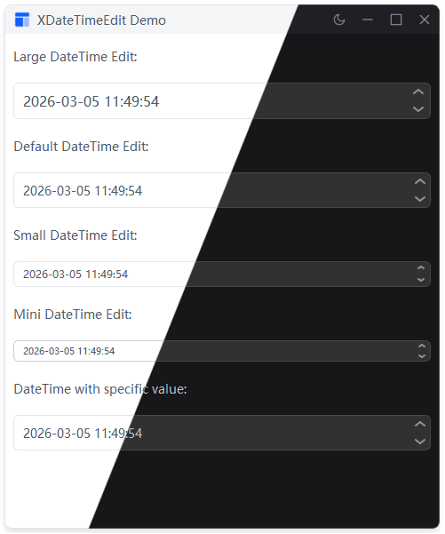

# XDateTimeEdit

日期时间编辑框，继承自 QDateTimeEdit。
## 示例



## 导入

```python
from xsideui import XDateTimeEdit, XSize
```

## 用法

```python
# 创建
datetime_edit = XDateTimeEdit() 

# 设置尺寸
datetime_edit.set_size(XSize.LARGE)

# 获取/设置日期时间
datetime_edit.setDateTime(QDateTime.currentDateTime())
current_datetime = datetime_edit.dateTime()
```

## 尺寸

| 枚举 | 字符串 |
|------|--------|
| `XSize.LARGE` | `"large"` |
| `XSize.DEFAULT` | `"default"` |
| `XSize.SMALL` | `"small"` |
| `XSize.MINI` | `"mini"` |

## 信号

继承自 QDateTimeEdit：`dateTimeChanged(QDateTime)`

## 样式

由 `qdatetimeedit.qss` 控制，通过 padding 调整高度。
