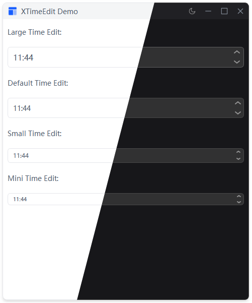

# XTimeEdit

时间编辑框，继承自 QTimeEdit。

## 示例


## 导入

```python
from xsideui import XQTimeEdit, XSize
```
## 用法

```python
# 创建
time_edit = XTimeEdit()

# 设置尺寸
time_edit.set_size(XSize.LARGE)

# 获取/设置时间
time_edit.setTime(QTime(12, 30, 0))
current_time = time_edit.time()
```

## 尺寸

| 枚举 | 字符串 |
|------|--------|
| `XSize.LARGE` | `"large"` |
| `XSize.DEFAULT` | `"default"` |
| `XSize.SMALL` | `"small"` |
| `XSize.MINI` | `"mini"` |

## 信号

继承自 QTimeEdit：`timeChanged(QTime)`

## 样式

由 `qtimeedit.qss` 控制，通过 padding 调整高度。
