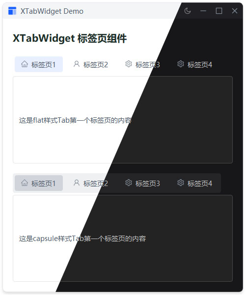

# XTabWidget

标签页组件，支持平滑的指示器动画，自动适配主题切换。

## 示例



## 导入

```python
from xsideui import XTabWidget
```

## 参数

| 参数 | 类型 | 默认值 | 说明 |
|------|------|--------|------|
| `parent` | QWidget | None | 父组件 |

## 示例

```python
# 基础标签页
tab_widget = XTabWidget(parent=parent)
tab_widget.addTab(widget1, "标签页1")
tab_widget.addTab(widget2, "标签页2")

# 带图标的标签页
from xsideui import IconName, XIcon
icon = XIcon(IconName.HOUSE, size=16)
tab_widget.addTab(widget1, icon, "标签页1")

# 获取当前选中的标签索引
current_index = tab_widget.currentIndex()

# 切换标签页
tab_widget.setCurrentIndex(1)
```

## 特性

- ✅ Ant Design 风格设计
- ✅ 平滑的指示器动画（300ms，OutCubic 缓动）
- ✅ 自动适配主题切换
- ✅ 支持图标
- ✅ 高分屏适配（DPR 感知）
- ✅ 动态指示器边距调整

## 实现细节

- **指示器动画**：使用 QPropertyAnimation 实现平滑的指示器位置过渡
- **主题适配**：指示器颜色自动使用主题的 primary 颜色
- **DPR 支持**：自动检测设备像素比，确保在高分屏上清晰显示
- **智能边距**：指示器左右边距根据标签位置动态调整，首标签边距逐渐增大
