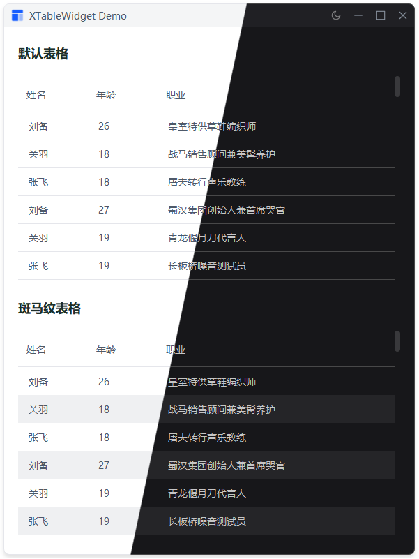

# XTableWidget

表格组件，提供丰富的样式定制和主题支持功能。
## 示例


## 导入
```python
from xsideui import XTableWidget
```

## 参数

| 参数 | 类型 | 默认值 | 说明 |
|------|------|--------|------|
| `headers` | list | None | 表头列表 |
| `column_widths` | list | None | 列宽列表，-1 表示自动拉伸 |
| `alignment` | Qt.Alignment | Qt.AlignLeft \| Qt.AlignVCenter | 对齐方式 |
| `style` | Style 或 str | Style.DEFAULT | 表格样式类型 |
| `row_height` | int | 40 | 行高（像素） |
| `parent` | QWidget | None | 父组件 |

## 样式

| 样式 | 枚举值 | 字符串值 | 斑马纹 | 适用场景 |
|------|--------|----------|--------|---------|
| 默认样式 | Style.DEFAULT | "default" | 否 | 简洁表格、数据量较少 |
| 斑马纹样式 | Style.STRIPED | "striped" | 是 | 数据量较多、需要区分行 |

## 方法

| 方法 | 说明 | 返回值 |
|------|------|--------|
| `set_headers(headers)` | 设置表头 | XTableWidget |
| `set_column_widths(widths)` | 设置列宽度 | XTableWidget |
| `set_alignment(alignment)` | 设置表格内容对齐方式 | XTableWidget |
| `set_style_type(style)` | 设置表格样式类型 | XTableWidget |
| `set_row_height(height)` | 设置行高 | XTableWidget |

## 示例

```python
# 基础表格
table = XTableWidget()
table.set_headers(["姓名", "年龄", "职位", "部门"])
table.set_column_widths([100, 80, 120, -1])

# 斑马纹样式
table = XTableWidget(style=XTableWidget.Style.STRIPED)
table.set_headers(["姓名", "年龄", "职位", "部门"])

# 添加数据
from PySide2.QtWidgets import QTableWidgetItem
table.setRowCount(3)
table.setItem(0, 0, QTableWidgetItem("张三"))
table.setItem(0, 1, QTableWidgetItem("28"))
table.setItem(0, 2, QTableWidgetItem("软件工程师"))
table.setItem(0, 3, QTableWidgetItem("研发部"))

# 链式调用
table = XTableWidget() \
    .set_headers(["姓名", "年龄"]) \
    .set_column_widths([100, 80]) \
    .set_style_type(XTableWidget.Style.STRIPED) \
    .set_alignment(Qt.AlignCenter) \
    .set_row_height(50)

# 自定义对齐方式
from PySide2.QtCore import Qt
table.set_alignment(Qt.AlignCenter)

# 设置行高
table.set_row_height(50)
```

## 特性

- ✅ 预设样式：默认样式和斑马纹样式
- ✅ 自定义样式：支持自定义行高、对齐方式等属性
- ✅ 主题适配：自动适配主题切换，支持明暗主题
- ✅ 空状态显示：内置空状态提示，提升用户体验
- ✅ 灵活布局：支持自定义列宽，支持自动拉伸
- ✅ 行选择模式：默认行选择模式，适合大多数场景
- ✅ 像素级滚动：精确控制滚动行为
- ✅ 无网格线：简洁的视觉设计
