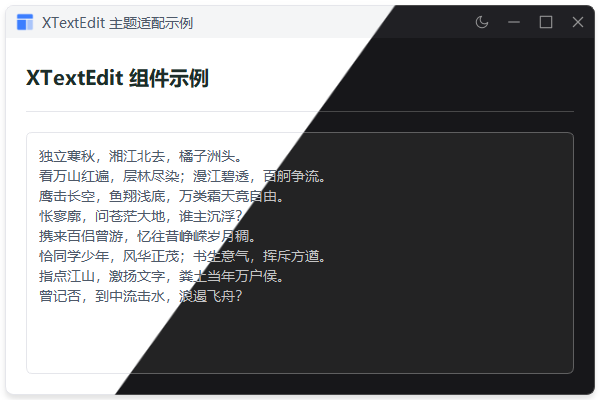

# XTextEdit

文本编辑器组件，支持明暗主题切换、占位文本、最大长度限制。
## 示例



## 导入

```python
from xsideui import XTextEdit
```

## 参数

| 参数 | 类型 | 默认值 | 说明 |
|------|------|--------|------|
| `text` | str | "" | 初始文本 |
| `placeholder` | str | "" | 占位文本 |
| `max_length` | int | 0 | 最大长度，0 表示不限制 |
| `read_only` | bool | False | 是否只读 |
| `parent` | QWidget | None | 父组件 |

## 示例

```python
# 基础用法
edit = XTextEdit(placeholder="请输入内容...")

# 带初始文本
edit = XTextEdit(text="初始文本")

# 最大长度限制
edit = XTextEdit(placeholder="最多200字", max_length=200)

# 只读模式
edit = XTextEdit(text="只读内容", read_only=True)

# 获取文本
text = edit.toPlainText()

# 设置文本
edit.setText("新内容")

# 清空
edit.clear()

# 监听文本变化
edit.textChanged.connect(lambda: print(edit.toPlainText()))
```

## 继承方法

继承自 `QTextEdit`，常用方法：

| 方法 | 说明 |
|------|------|
| `toPlainText()` | 获取文本 |
| `setText(text)` | 设置文本 |
| `append(text)` | 追加文本 |
| `clear()` | 清空文本 |
| `setPlaceholderText(text)` | 设置占位文本 |
| `setReadOnly(bool)` | 设置只读 |
