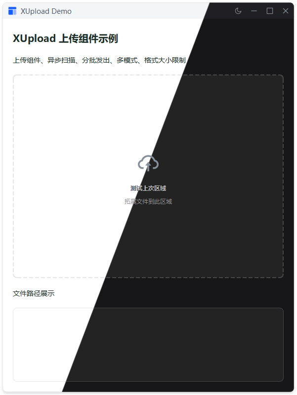

# XUpload 上传组件

高性能文件上传触发组件，支持拖拽上传、文件类型和大小限制。

## 特性

- 🚀 **高性能** - 异步扫描，分批处理，支持大量文件
- 📁 **多模式** - 支持文件、文件夹、混合三种模式
- 🎯 **智能过滤** - 文件类型和大小限制
- 🎨 **主题适配** - 自动适配明暗主题
- ⚡ **流畅交互** - 拖拽动画，实时反馈

## 示例



## 快速开始

```python
from src.xsideui.widgets import XUpload

# 基础用法
upload = XUpload()
upload.files_processed.connect(lambda files: print(f"上传: {files}"))
upload.scan_finished.connect(lambda count: print(f"共 {count} 个文件"))
```

## 构造函数

```python
XUpload(
    title: str = "",                    # 主标题文本
    description: str = "",              # 辅助描述文本
    mode: int = MODE_BOTH,              # 上传模式
    accept_types: List[str] = None,     # 文件类型列表
    max_size: int = -1,                 # 最大文件大小（字节）
    mini_height: int = 200,             # 最小高度（像素）
    show_border: bool = True,           # 是否显示边框
    parent: QWidget = None,
)
```

## 模式常量

| 常量 | 值 | 说明 |
|------|-----|------|
| `MODE_FILES` | `0` | 仅文件模式 |
| `MODE_FOLDERS` | `1` | 仅文件夹模式 |
| `MODE_BOTH` | `2` | 混合模式（默认） |

## 信号

| 信号 | 说明 |
|------|------|
| `files_processed(list)` | 文件扫描结果（分批发出） |
| `scan_finished(int)` | 扫描完成，返回文件总数 |
| `file_error(str, str)` | 文件错误（文件名, 错误信息） |

## 方法

### `set_accept_types(types)`

设置接受的文件类型。

```python
upload.set_accept_types([".jpg", ".png", ".gif"])
```

### `set_max_size(bytes_val)`

设置最大文件大小。

```python
upload.set_max_size(5 * 1024 * 1024)  # 5MB
```

## 使用示例

### 示例 1：文件上传

```python
upload = XUpload(
    mode=XUpload.MODE_FILES,
    accept_types=[".txt", ".py", ".md"],
    max_size=5 * 1024 * 1024  # 5MB
)
```

### 示例 2：文件夹上传

```python
upload = XUpload(
    mode=XUpload.MODE_FOLDERS,
    title="点击或拖拽文件夹到此处",
    description="将递归扫描所有子文件"
)
```

### 示例 3：自定义样式

```python
upload = XUpload(
    show_border=False,
    mini_height=150,
    title="点击选择文件",
    description="支持 JPG、PNG 格式"
)
```

### 示例 4：链式配置

```python
upload = XUpload() \
    .set_accept_types([".jpg", ".png"]) \
    .set_max_size(10 * 1024 * 1024)
```

### 示例 5：监听上传结果

```python
from PySide2.QtWidgets import QListWidget

upload = XUpload()
file_list = QListWidget()

# 分批接收文件
upload.files_processed.connect(lambda files: [
    file_list.addItem(file_path) for file_path in files
])

# 扫描完成
upload.scan_finished.connect(lambda count: print(f"完成！共 {count} 个文件"))

# 错误处理
upload.file_error.connect(lambda name, error: print(f"错误: {name} - {error}"))
```

## 性能特性

- **分批处理** - 每 200 个文件发送一次信号，防止主线程阻塞
- **异步扫描** - 使用独立线程处理文件，保持 UI 流畅
- **智能缓存** - 递归扫描文件夹时自动过滤无效文件

## 运行示例

```bash
python example/xupload_example.py
```

## 注意事项

1. 文件夹模式会递归扫描所有子文件
2. 文件大小限制为单个文件，非总大小
3. 混合模式下拖拽文件夹会提取所有子文件
4. 扫描过程中会显示"解析路径中..."状态
