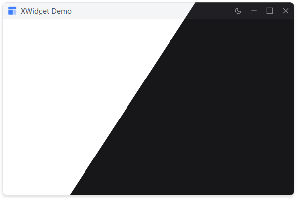

# XWidget

XDialog 和 XWidget 是两个无边框窗口组件，支持标题栏、阴影、拖拽、最大化等功能。
两个窗口使用方式一致、XDialog继承QDialog   XWidget继承QWidget

## 示例


## 导入

```python
from xsideui import XWidget, XDialog
```

## 参数

| 参数 | 类型 | 默认值 | 说明 |
|------|------|--------|------|
| `title` | str | "XWidget" | 窗口标题 |
| `logo` | str | None | 窗口图标 |
| `show_min` | bool | True | 显示最小化按钮 |
| `show_max` | bool | True | 显示最大化按钮 |
| `show_close` | bool | True | 显示关闭按钮 |
| `show_dark` | bool | True | 显示主题切换按钮 |
| `parent` | QWidget | None | 父组件 |

## 方法

| 方法 | 说明 | 返回值 |
|------|------|--------|
| `addWidget(widget)` | 添加组件 | XWidget |
| `addLayout(layout)` | 添加布局 | XWidget |
| `set_title(title)` | 设置标题 | XWidget |
| `set_logo(icon)` | 设置图标 | XWidget |
| `hide_title_bar()` | 隐藏标题栏 | XWidget |
| `hide_minimize_button()` | 隐藏最小化按钮 | XWidget |
| `hide_maximize_button()` | 隐藏最大化按钮 | XWidget |
| `hide_theme_button()` | 隐藏主题按钮 | XWidget |

## 示例

```python
# 基础窗口
window = XWidget(title="窗口标题")

# 添加内容
window.addWidget(XLabel("内容"))
window.addWidget(XPushButton("按钮"))

# 链式调用
window = XWidget(title="标题") \
    .addWidget(XLabel("内容")) \
    .addWidget(XPushButton("按钮"))

# 自定义按钮显示
window = XWidget(
    title="标题",
    show_min=False,
    show_max=False
)
window.addWidget(XLabel("内容"))

# 隐藏标题栏
window = XWidget(title="标题")
window.hide_title_bar()
window.addWidget(XLabel("无标题栏窗口"))

# 设置图标
window = XWidget(title="标题")
window.set_logo("path/to/icon.png")
window.addWidget(XLabel("内容"))
```

## 特性

- ✅ 无边框窗口
- ✅ 标题栏拖拽
- ✅ 阴影效果
- ✅ 最小化/最大化/关闭
- ✅ 主题切换按钮
- ✅ 四角调整大小
- ✅ 自动居中到父组件
- ✅ 最大化时移除阴影边距
